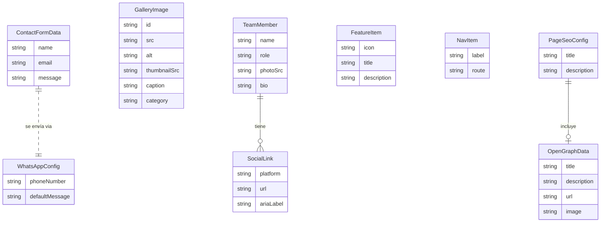

# Entidades del Dominio

---

## Interfaces Principales

### ContactFormData
```typescript
interface ContactFormData {
  name: string;       // Nombre del usuario (2-100 chars)
  email: string;      // Email válido (RFC 5322, máx 254 chars)
  message: string;    // Mensaje de contacto (10-1000 chars)
}
```

### ThemeMode
```typescript
type ThemeMode = 'light' | 'dark';
```

### AppLocale
```typescript
type AppLocale = 'es' | 'en';
```

---

## Interfaces de Componentes UI

### AccordionItem
```typescript
interface AccordionItem {
  id: string;           // Identificador único
  title: string;        // Título del panel (texto traducible)
  content: string;      // Contenido del panel (texto o HTML seguro)
}
```

### TabItem
```typescript
interface TabItem {
  id: string;           // Identificador único
  label: string;        // Etiqueta de la pestaña (texto traducible)
  content: string;      // Contenido del panel de pestaña
}
```

### GalleryImage
```typescript
interface GalleryImage {
  id: string;           // Identificador único
  src: string;          // URL de la imagen
  alt: string;          // Texto alternativo descriptivo
  thumbnailSrc: string; // URL del thumbnail para grid
  caption?: string;     // Pie de imagen opcional
  category?: string;    // Categoría para filtrado opcional
}
```

### TeamMember
```typescript
interface TeamMember {
  name: string;         // Nombre completo
  role: string;         // Cargo o rol
  photoSrc: string;     // URL de foto
  photoAlt: string;     // Texto alt de foto
  bio?: string;         // Biografía breve opcional
  socialLinks?: SocialLink[];  // Redes sociales opcionales
}
```

### SocialLink
```typescript
interface SocialLink {
  platform: 'linkedin' | 'twitter' | 'github' | 'instagram' | 'facebook';
  url: string;          // URL del perfil
  ariaLabel: string;    // Label accesible
}
```

### FeatureItem
```typescript
interface FeatureItem {
  icon: string;         // Nombre o clase del ícono
  title: string;        // Título de la característica
  description: string;  // Descripción breve
}
```

### NavItem
```typescript
interface NavItem {
  label: string;        // Texto del enlace (traducible)
  route: string;        // Ruta del router (ej. '/about')
  ariaLabel?: string;   // Label accesible opcional
}
```

---

## Interfaces de Servicios

### MetaTag
```typescript
interface MetaTag {
  name?: string;        // ej. 'description', 'keywords'
  property?: string;    // ej. 'og:title', 'og:description'
  content: string;      // Valor del meta tag
}
```

### OpenGraphData
```typescript
interface OpenGraphData {
  title: string;
  description: string;
  url: string;
  image?: string;
  type?: string;        // default: 'website'
  locale?: string;      // 'es_ES' | 'en_US'
}
```

### PageSeoConfig
```typescript
interface PageSeoConfig {
  title: string;             // Título de la página
  description: string;       // Meta description
  ogData?: OpenGraphData;    // Datos Open Graph
  jsonLd?: object;           // Datos estructurados JSON-LD
}
```

### WhatsAppConfig
```typescript
interface WhatsAppConfig {
  phoneNumber: string;    // Número con código de país (solo dígitos, ej. '521234567890')
  defaultMessage?: string; // Mensaje por defecto opcional
}
```

---

## Interfaces de Animaciones

### AnimationConfig
```typescript
interface AnimationConfig {
  duration: number;      // Duración en ms
  delay?: number;        // Delay en ms
  easing?: string;       // Función de timing (ej. 'ease-in-out')
}
```

---

## Enumeraciones

### ButtonVariant
```typescript
type ButtonVariant = 'primary' | 'secondary' | 'outline' | 'icon';
```

### ButtonSize
```typescript
type ButtonSize = 'sm' | 'md' | 'lg';
```

### CardVariant
```typescript
type CardVariant = 'feature' | 'team' | 'testimonial';
```

### DividerVariant
```typescript
type DividerVariant = 'line' | 'wave' | 'gradient';
```

### TooltipPosition
```typescript
type TooltipPosition = 'top' | 'bottom' | 'left' | 'right';
```

### SpinnerSize
```typescript
type SpinnerSize = 'sm' | 'md' | 'lg';
```

---

## Diagrama de Relaciones de Entidades


