# Dependencias de Componentes

---

## Diagrama de Dependencias

```mermaid
graph TD
    subgraph Layout["Componentes de Layout"]
        Header["HeaderComponent"]
        Footer["FooterComponent"]
        Drawer["MobileMenuDrawerComponent"]
    end

    subgraph Pages["Componentes de Página"]
        Home["HomePageComponent"]
        About["AboutPageComponent"]
        Features["FeaturesPageComponent"]
        Gallery["GalleryPageComponent"]
        Contact["ContactPageComponent"]
    end

    subgraph UI["Componentes UI Reutilizables"]
        Btn["ButtonComponent"]
        Card["CardComponent"]
        Modal["ModalComponent"]
        FormField["FormFieldComponent"]
        Accordion["AccordionComponent"]
        Tabs["TabsComponent"]
        Badge["BadgeComponent"]
        Tooltip["TooltipDirective"]
        Spinner["SpinnerComponent"]
        Divider["SectionDividerComponent"]
    end

    subgraph Shared["Componentes Compartidos"]
        Toggle["ThemeToggleComponent"]
        LangSwitch["LanguageSwitcherComponent"]
        SkipNav["SkipNavComponent"]
        BackTop["BackToTopComponent"]
    end

    subgraph Services["Servicios"]
        ThemeSvc["ThemeService"]
        ScrollSvc["ScrollService"]
        SeoSvc["SeoService"]
        WhatsAppSvc["WhatsAppService"]
        AnimSvc["AnimationService"]
    end

    Header --> Toggle
    Header --> LangSwitch
    Header --> Drawer

    Drawer --> Toggle
    Drawer --> LangSwitch

    Home --> Card
    Home --> Btn
    Home --> Divider

    About --> Card
    About --> Divider

    Features --> Card
    Features --> Btn
    Features --> Divider

    Gallery --> Card
    Gallery --> Modal
    Gallery --> Btn

    Contact --> FormField
    Contact --> Btn

    Toggle --> ThemeSvc
    BackTop --> ScrollSvc

    Home --> ScrollSvc
    Home --> SeoSvc
    Features --> ScrollSvc
    Features --> SeoSvc
    About --> SeoSvc
    Gallery --> SeoSvc
    Contact --> SeoSvc
    Contact --> WhatsAppSvc

    Home --> AnimSvc
    Features --> AnimSvc
    Gallery --> AnimSvc
```



---

## Matriz de Dependencias

### Componentes de Layout → Dependencias

| Componente | Usa Componentes | Usa Servicios |
|---|---|---|
| **HeaderComponent** | ThemeToggleComponent, LanguageSwitcherComponent, MobileMenuDrawerComponent | — |
| **FooterComponent** | — | — |
| **MobileMenuDrawerComponent** | ThemeToggleComponent, LanguageSwitcherComponent | — |

### Componentes de Página → Dependencias

| Componente | Usa Componentes UI | Usa Servicios |
|---|---|---|
| **HomePageComponent** | CardComponent, ButtonComponent, SectionDividerComponent | ScrollService, SeoService, AnimationService |
| **AboutPageComponent** | CardComponent, SectionDividerComponent | SeoService |
| **FeaturesPageComponent** | CardComponent, ButtonComponent, SectionDividerComponent | ScrollService, SeoService, AnimationService |
| **GalleryPageComponent** | CardComponent, ModalComponent, ButtonComponent | SeoService, AnimationService |
| **ContactPageComponent** | FormFieldComponent, ButtonComponent | SeoService, WhatsAppService |

### Componentes Compartidos → Dependencias

| Componente | Usa Servicios |
|---|---|
| **ThemeToggleComponent** | ThemeService |
| **LanguageSwitcherComponent** | — (redirección directa por URL) |
| **SkipNavComponent** | — |
| **BackToTopComponent** | ScrollService |

---

## Patrones de Comunicación

### 1. Comunicación Padre → Hijo (Input Binding)
- `HeaderComponent` → `MobileMenuDrawerComponent` (isOpen signal)
- Páginas → Componentes UI (datos vía @Input)

### 2. Comunicación Hijo → Padre (Output Events)
- `MobileMenuDrawerComponent` → `HeaderComponent` (evento closed)
- `ModalComponent` → `GalleryPageComponent` (evento closed)
- `FormFieldComponent` → `ContactPageComponent` (evento valueChange)

### 3. Comunicación via Servicios (Signal-based)
- `ThemeToggleComponent` ↔ `ThemeService` — lectura/escritura del tema actual
- `BackToTopComponent` ↔ `ScrollService` — lectura de posición de scroll
- Páginas ↔ `SeoService` — actualizar meta tags al activar ruta
- `ContactPageComponent` → `WhatsAppService` — enviar datos del formulario

### 4. Comunicación via Router
- `LanguageSwitcherComponent` → Router — redirigir al build del idioma alternativo
- Transiciones de ruta → `AnimationService` — animaciones de cambio de página

---

## Flujo de Datos por Funcionalidad

### Flujo: Toggle de Tema
```
Usuario → ThemeToggleComponent.toggleTheme() → ThemeService.toggleTheme()
  → actualiza Signal<'light'|'dark'>
  → aplica/remueve clase 'dark' en <html>
  → persiste en localStorage
  → ThemeToggleComponent reactivamente actualiza ícono
```

### Flujo: Formulario de Contacto → WhatsApp
```
Usuario → FormFieldComponent(s) → valores en formulario reactivo
  → ContactPageComponent.onSubmit() valida formulario
  → WhatsAppService.buildWhatsAppUrl(formData)
  → WhatsAppService.openChat() abre wa.me en nueva ventana
```

### Flujo: Cambio de Idioma
```
Usuario → LanguageSwitcherComponent.switchLanguage('en')
  → navega a build de idioma alternativo (ej. /en/...)
  → @angular/localize renderiza contenido en nuevo idioma
```

### Flujo: Back to Top
```
ScrollService detecta scroll position > threshold
  → BackToTopComponent.isVisible() se vuelve true
  → Botón aparece con animación
  → Usuario hace clic → ScrollService.scrollToTop()
  → Scroll suave a posición 0
```
