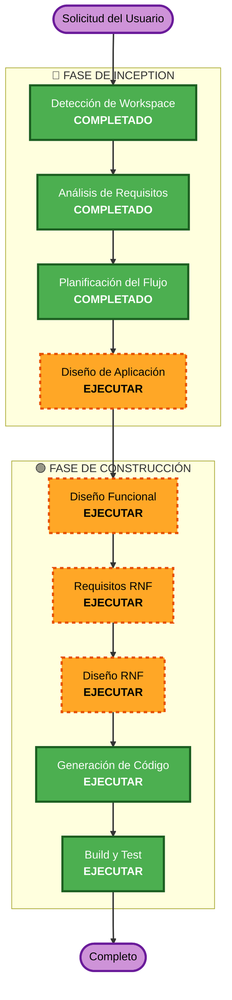

# Plan de Ejecución

## Resumen del Análisis Detallado

### Evaluación de Impacto de Cambios
- **Cambios visibles al usuario**: Sí — Sitio completo nuevo con UI/UX moderno, i18n bilingüe, modo oscuro/claro
- **Cambios estructurales**: Sí — Arquitectura Angular 19 completa desde cero con standalone components
- **Cambios en modelo de datos**: No — Sitio estático sin base de datos ni modelos persistentes
- **Cambios de API**: No — Sin APIs backend, sin contratos de servicio
- **Impacto en RNF**: Sí — Accesibilidad WCAG AAA, rendimiento Lighthouse 90+, seguridad de headers HTTP

### Evaluación de Riesgos
- **Nivel de Riesgo**: Bajo — Proyecto greenfield sin dependencias ni sistemas existentes que puedan romperse
- **Complejidad de Rollback**: Fácil — Cualquier cambio puede revertirse vía Git
- **Complejidad de Testing**: Moderada — WCAG AAA requiere pruebas de accesibilidad exhaustivas

---

## Visualización del Flujo de Trabajo



### Alternativa en Texto
```
Fase 1: INCEPTION
  - Etapa 1: Detección de Workspace (COMPLETADO)
  - Etapa 2: Análisis de Requisitos (COMPLETADO)
  - Etapa 3: Planificación del Flujo de Trabajo (COMPLETADO)
  - Etapa 4: Diseño de Aplicación (EJECUTAR)

Fase 2: CONSTRUCCIÓN
  - Etapa 5: Diseño Funcional (EJECUTAR)
  - Etapa 6: Requisitos RNF (EJECUTAR)
  - Etapa 7: Diseño RNF (EJECUTAR)
  - Etapa 8: Generación de Código (EJECUTAR)
  - Etapa 9: Build y Test (EJECUTAR)
```

---

## Fases a Ejecutar

### 🔵 FASE DE INCEPTION
- [x] Detección de Workspace (COMPLETADO)
- [x] Ingeniería Inversa (OMITIDO — proyecto greenfield, sin código existente)
- [x] Análisis de Requisitos (COMPLETADO)
- [x] User Stories (OMITIDO)
  - **Justificación**: Sitio de marketing estático con requisitos claros y bien definidos. Sin múltiples personas de usuario complejas. Los requisitos funcionales ya cubren los escenarios de uso.
- [x] Planificación del Flujo de Trabajo (COMPLETADO)
- [x] Diseño de Aplicación - **COMPLETADO**
  - **Justificación**: Se necesita definir la estructura completa de componentes, servicios, y sus responsabilidades. La arquitectura basada en componentes requiere planificación detallada de: componentes reutilizables (RF-06), layout (RF-01/RF-02), servicios de tema (RF-03), servicio i18n (RF-04), y la organización de carpetas del proyecto.
- [x] Generación de Unidades (OMITIDO)
  - **Justificación**: Proyecto de alcance moderado (4-6 páginas estáticas) que puede manejarse como una sola unidad de trabajo. No requiere descomposición en múltiples unidades paralelas.

### 🟢 FASE DE CONSTRUCCIÓN (1 unidad de trabajo)
- [x] Diseño Funcional - **COMPLETADO**
  - **Justificación**: Se necesita diseñar la lógica de los componentes: servicio de tema (oscuro/claro con detección de sistema), servicio i18n (cambio de idioma, persistencia), validación de formulario de contacto, y comportamiento de navegación responsiva. Reglas de negocio para accesibilidad WCAG AAA.
- [x] Requisitos RNF - **COMPLETADO**
  - **Justificación**: Múltiples RNF significativos: WCAG 2.1 AAA (nivel más exigente), rendimiento Lighthouse 90+, seguridad de headers HTTP, compatibilidad multi-navegador, y pipeline CI/CD. Requiere evaluación detallada.
- [x] Diseño RNF - **COMPLETADO**
  - **Justificación**: Los requisitos RNF necesitan traducirse en patrones concretos: configuración de Tailwind para accesibilidad, optimización de bundle, configuración de CSP, estrategia de lazy loading, y pipeline de GitHub Actions.
- [x] Diseño de Infraestructura - **OMITIDO**
  - **Justificación**: Sin infraestructura cloud. El despliegue es GitHub Pages (estático), manejado completamente por GitHub Actions. No hay servicios cloud, balanceadores, bases de datos ni recursos de infraestructura que diseñar.
- [x] Generación de Código - **COMPLETADO**
  - **Justificación**: Implementación del código de la aplicación Angular completa.
- [x] Build y Test - **COMPLETADO**
  - **Justificación**: Instrucciones de build, pruebas unitarias, pruebas de componentes y verificación.

### 🟡 FASE DE OPERACIONES
- [x] Operaciones - COMPLETADO
  - **Justificación**: Cierre operativo y documental completado con evidencia de despliegues, hardening CSP/headers y verificación de checklists finales.

---

## Criterios de Éxito
- **Objetivo Principal**: Aplicación Angular 19 funcional desplegada en GitHub Pages como sitio de marketing moderno
- **Entregables Clave**:
  - Proyecto Angular 19 scaffolded con standalone components y signals
  - 4-6 páginas completamente responsivas (5 breakpoints)
  - Sistema de componentes UI reutilizables
  - Toggle modo oscuro/claro funcional
  - Soporte bilingüe (ES/EN) completo
  - Pipeline CI/CD de GitHub Actions
  - Pruebas unitarias y de componentes (80%+ cobertura)
- **Puertas de Calidad**:
  - WCAG 2.1 AAA — todas las auditorías de accesibilidad pasadas
  - Lighthouse Performance 90+
  - Todas las pruebas unitarias y de componentes pasadas
  - Build de producción exitoso
  - Reglas de seguridad cumplidas (headers, supply chain, hardening)

---

## Cumplimiento de Extensiones de Seguridad

| Extensión | Estado | Justificación |
|---|---|---|
| Security Baseline | Habilitada | Aplicable — se verificará cumplimiento en cada etapa relevante |
